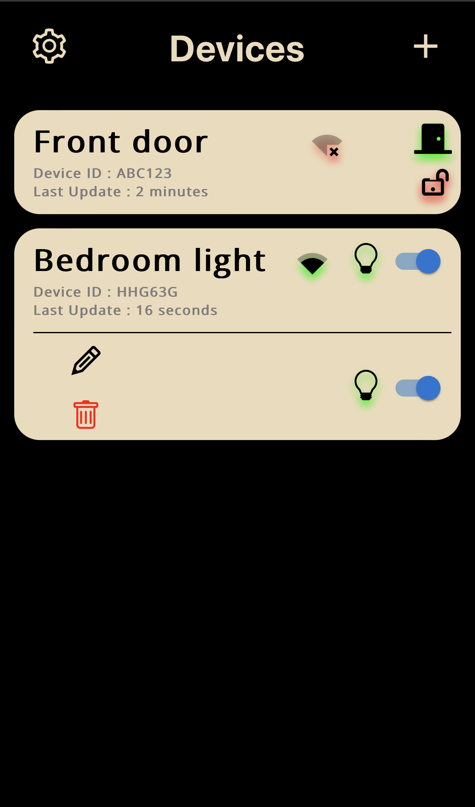

<p align="center">
  <a href="https://skillicons.dev">
    
  </a>
</p>

# IoTStation
### Make your own IoT devises, monitor and control them.
IoTStation is a generalized system that let’s you create, monitor and control your IoT Devices. The main advantage of this system is that you only code your IoT Device, you don’t need to touch the back-end or front-end code, the system will represent the device features in a proper way.

<p align="center">
 
 </p>

## Create your own IoT devices
With IoTStation you only need to write software for the hardware side (ex: Arduino), add your own features like a door state [open, close], or a light switch [on, off]. Type and number of features does not matter here, the system can handle them with ease, that because the system communicate with hardware devises via a Specific JSON Structure, the system front-end and back-end can accept any thing as long as the data is within the Specific JSON Structure.

## Specific JSON Structure (SJS)
We have two categories of states, **informative** and **controller**. Informative is for monitoring stuff, like a door state, [open, closed], or as a power draw value [385.43w].

Controllers is basically for controlling stuff, normal light, RGB light, or maybe a curtain state [50% opened] etc..

### Known & Unknown states
In the front-end, device states are divided into two groups, known and unknown states. Known states have representation in the front-end by icons, but the Unknown states don’t, they are represented by plain text [hardware row data] without icons.


Example of SJS hardware to server update:
```
{
	"auth":{
		"id":"abc",    # Device id
		"key":"abc123" # Device access-key, to update it's state on the server
	},
	"data":{
		"m":{ # UI main menu
			"i":{ # informative states
				look:"closed",  # known state								
				power-watt:"600.82",  # known state
			},
			"c":{ # controller states
				switch_1:"off", # unknown state
			}
		},
		"s":{ # UI sub menu
			"i":{ # informative states
				state_3:"medium" # unknown state
				water_flow:"9.16m^3", # unknown state
			},
			"c":{ # controller states
				light:"on",  # known state
			}
		},
		"o":{ # OPTIONS, some config stuff. (future features :))

		}
	}
}
```

Example of SJS server to hardware update:
```
{
	"t":"<time stamp>",
	"u":{ # contains only Controller states updates
		switch_1:"on",
		light:"off"
	}	
}
```
