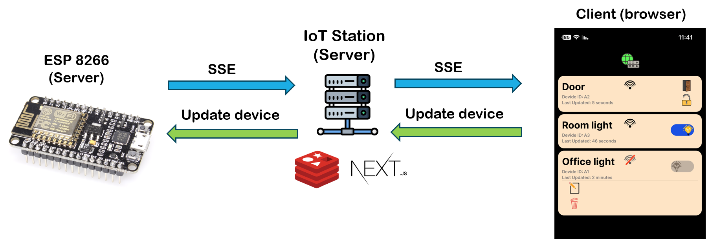

<p align="center">
  <a href="https://skillicons.dev">
    
  </a>
</p>

## IoTStation

**IoTStation** is a generalized system that let’s you create, monitor and control your IoT Devices. The main advantage of this system is that you only code your IoT Device, you don’t need to touch the back-end or front-end code, the system will represent device features in a proper way.

<p align="center">
 
 </p>

## **Create your own IoT devices**

With IoTStation you only need to write software for the hardware side (ex: Arduino), add your own features like a door state [open, close], or a light switch [on, off]. Type and number of features does not matter here, the system can handle them with ease, that because the system communicate with hardware devises via a Specific JSON Structure, the system front-end and back-end can accept any thing as long as the data is within the Specific JSON Structure.

We have two categories of states, **informative** and **controller**. Informative is for monitoring stuff, like a door state, [open, closed], or as a power draw value [385.43w]. Controllers are basically for controlling stuff, normal light, RGB light, or maybe a curtain state [50% opened] etc..

One more thing. In the front-end, device states are divided into two groups, known and unknown states. Known states have representation in the front-end by icons, but the Unknown states don’t, they are represented by plain text [hardware row data] without icons.


Here is the SJS containing IoT device status:
```
{
	"auth":{
		"id":"abc",    # Device id
		"key":"abc123" # Device access-key, to update it's state on the server
	},
	"data":{
		"m":{ # UI main menu
			"i":{ # informative states
				look:"closed",  # known state								
				power-watt:"600.82",  # known state
			},
			"c":{ # controller states
				switch_1:"off", # unknown state
			}
		},
		"s":{ # UI sub menu
			"i":{ # informative states
				state_3:"medium" # unknown state
				water_flow:"9.16m^3", # unknown state
			},
			"c":{ # controller states
				light:"on",  # known state
			}
		},
		"o":{ # OPTIONS, some config stuff. (future features :))

		}
	}
}
```

Here is the SJS sending controlling commands to IoT device:
```
{
	"t":"<time stamp>",
	"u":{ # contains only Controller states updates
		switch_1:"on",
		switch_light_1:"off"
	}	
}
```

## System architecture

We used Server-Sent-Events (SSE) to send device updates. And a POST request to update the device “control it.”



## How does it work?

IoTStation server scans the local network for IoTStation devices (in my case ESP8266 server), then the device will show up in the browser automatically.

The scan for new devices is triggered every 10 seconds.

## Requirements
- Redis

## Setup

In the Arduino example, at the root dir, create a file named `auth.h` as the following:
```
const char* auth_wifi_ssid="Your_WIFI_SSID";
const char* auth_wifi_password="Your_WIFI_Password";

String auth_Device_id="A1"; // id of your choice
String auth_Device_access_key="ASD123"; //access_key of your choice
```
Also, you need to specify what local ip addresses ranges are allowed to scan for devices on them. modify default values to your preference. find it in `nextjs\onStartUp\localDevicesScan.ts`
```
const toIgnoreFirstOctat=['127','172']; // ignore 127.x.x.x and 172.x.x.x
const toAllowThirdOctat=['0','8']; // allow x.x.0.x and x.x.8.x
```


## Versions:

- Version 1.0 (Old Framework): This version was built using **Django** framework and includes the following tools: React, SQLLite, Arduino, Python
- Version 2.0 (New Framework): This version has been migrated to **NextJS** and includes the following tools: React, Redis, Arduino, Python, TypeScript, Tailwind


## License
[GNU General Public License v3.0](LICENSE) or later
